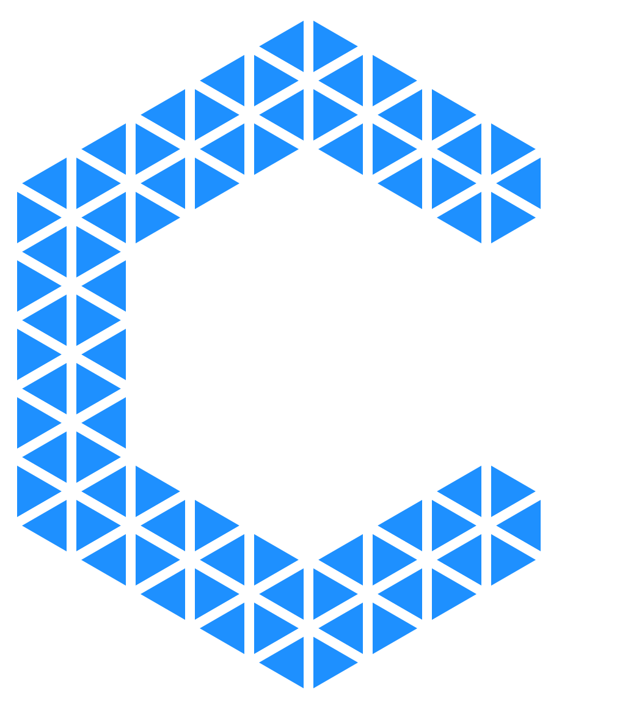

<p align="center">
    
</p>

# Entity-Builder

:tomato: Laravel generator [Online](https://googee.github.io/Entity-Builder/dist)

[中文介绍](README.zh.md)


## Feature

- Custom layer (Controller, Model, Repository, etc.)
- Custom template (not plain text, with syntax: `for`, `if`, etc.)
- Convert database schema to Laravel Migration
- Deploy PHP code online
- Design table fields and indexes
- Define model factories
- Generate field validation rules


## Example

### Create a Migration


### Add validation rules


### Convert database schema to Laravel Migration


### Add doc to `Model` automatically


## Deploy PHP code online

Only available in `local` environment!

1. Download the [dist.zip](https://github.com/GooGee/Entity-Builder/releases)
1. Unzip it to the public folder of your Laravel project
1. Visit http://localhost/dist/index.html
1. Install the PHP [package](https://github.com/GooGee/Entity)
1. Click 'Connect' button


## Document

[Template](https://mozilla.github.io/nunjucks/templating.html)

[Entity-Doc](https://googee.github.io/Entity-Builder/docs/model/index.html)


## Project setup
```
npm install
```

### Compiles and hot-reloads for development
```
npm run serve
```

### Compiles and minifies for production
```
npm run build
```

### Run your tests
```
npm run test
```

### Lints and fixes files
```
npm run lint
```

### Customize configuration
See [Configuration Reference](https://cli.vuejs.org/config/).
